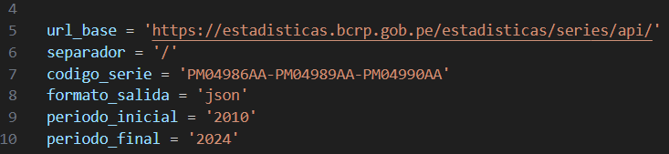
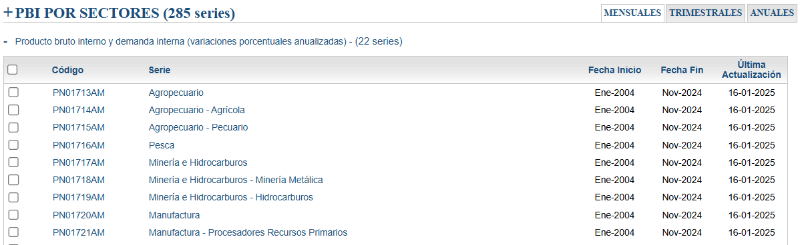

# API BCRP
### Descripción
- Este es un proyecto que permite acceder a información de las series estadísticas del __Banco Central de Rerserva del Perú__ a través de la __API__ que ha dispuesto la misma entidad en favor del público en general. 
- El proyecto fue desarrollado completamente en el lenguaje de __python__. 
- La librerías usadas fueron: __pandas__, __requests__ y __numpy__

### Guía de uso
- Para acceder a los datos de un serie estadística, se tiene que pegar el __código de la serie__ en la línea 5 del archivo .py: `codigo_serie= 'PM04986AA'`. 

- __Obtener el código de un serie__:

El código de la serie la pueden encontrar en la propia plataforma del BCRP. Por ejemplo, si quisieramos obtener los datos del __PBI Agropecuario__, solo bastaría con copiar su código: 	`PN01713AM` y pegarlo en la línea de código respectiva. 

- __Obtener los datos de más de una serie a la vez__:

Para lograr esto solo basta con copiar el código de las series y separarlas por un guión `-`.
  - 1 serie: `codigo_serie: 'PM04986AA'`
  - 3 series: `codigo_serie = 'PM04986AA-PM04989AA-PM04990AA'`
### Importante:

- Si se quiere acceder a los datos de más de una serie en simultánea, se recomienda __NO__ combinar series de diferentes periodicidades. 
- Es decir, si una serie es anual, la demás deberán de ser anuales. Si es mensual, de igual manera, las otras deberán de ser mensuales y así sucesivamente.
